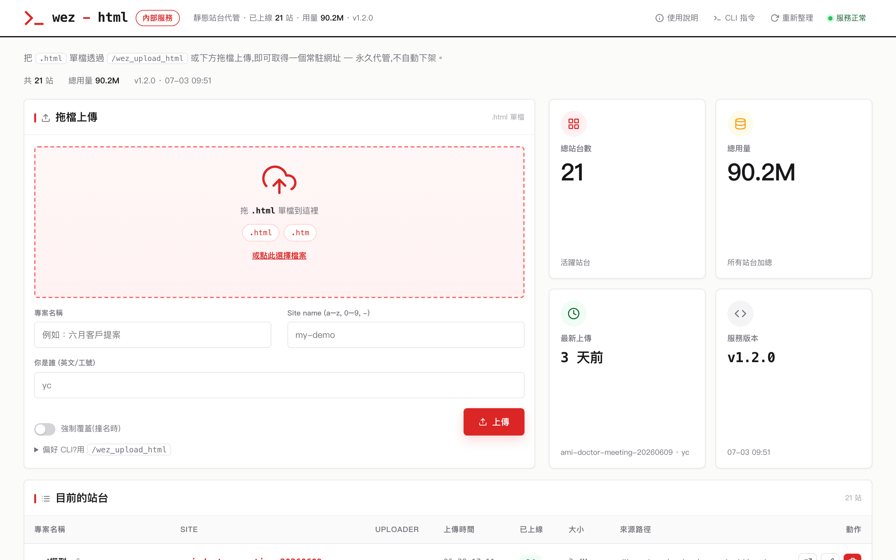
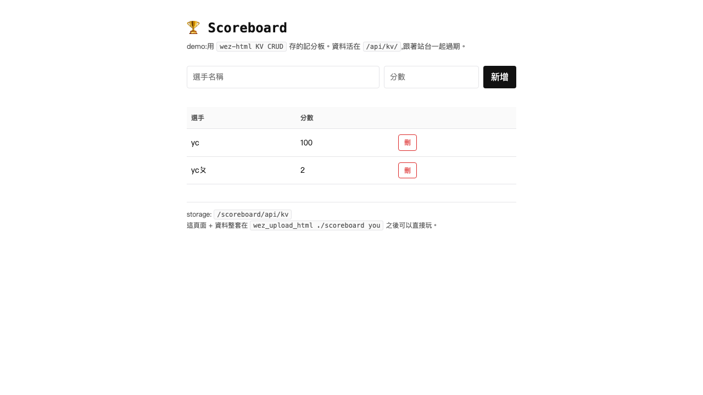

# wez-html

> 給小團隊內網用的靜態站台服務。一行 command 把任何前端推上去，拿到常駐網址。

```bash
$ ./bin/wez_upload_html ./frontend yc
✅ http://10.1.1.7:8090/frontend/  · uploader=yc  size=39.0K
```

最常見的入口是 [Claude Code plugin `/wez:upload-html`](https://github.com/yanchen184/wezoomtek-claude-code-plugin)——一句中文需求，plugin 寫完整頁 HTML 再推上去（見下方 [Claude Code plugin](#claude-code-plugin) 段）。



> 📖 **不是工程師、只想把一個網頁丟上去拿連結？** 看 [**操作手冊**](docs/操作手冊.md) —— 一步步照做、含疑難排解表，不用懂技術。下面是給開發者 / 維運看的完整說明。

## 為什麼有這個

過去推一個 demo 要做五件事：

1. `rsync` 推檔到內網某台機器
2. `ssh` 進去找個沒被佔的 port
3. `python -m http.server` 或起個 nginx
4. 貼 URL 給同事
5. 兩個月後忘了清，垃圾留在機器上

`wez-html` 把這五件事壓成一句 CLI，再補上三件原本沒有的：

- **Uploader 追溯** — 每個站台記 uploader identity，只有同一個 identity 能刪除
- **Web 介面** — 拖檔上傳 + 站台列表 + 一鍵刪除，不會 CLI 也能用
- **KV CRUD** — 每站附一份 JSON key-value store，給前端存 demo 等級的資料

站台推上去後**永久常駐，不自動下架**。要刪自己刪，或從 Web UI 操作。

## 適合 / 不適合

| 適合 | 不適合 |
|---|---|
| 內網 demo / PoC / 個人賽作品分享 | Production hosting |
| 短期 landing page 或靜態投影片 | 需要長期穩定 URL 的對外站 |
| 純靜態檔 + 輕量 CRUD（KV JSON） | 關聯式 query / 複雜 schema |
| VPN / 辦公室 LAN 信任環境 | 公網開放（沒身份驗證） |

## 三種用法

### 1. Claude Code plugin（推薦，內建 Mode A / B / C）

裝 plugin（[wezoomtek-claude-code-plugin](https://github.com/yanchen184/wezoomtek-claude-code-plugin)）後在 Claude Code 直接打：

```
/wez:upload-html ai-report.html yc          ← Mode A：推已有的 .html
/wez:upload-html yc "問卷 5 題畫圓餅圖"        ← Mode B：一句中文需求，Claude 寫網站 + 接 KV 再推
/wez:upload-html --list                     ← Mode C：管理（list / delete）
```

Mode B 會自動生整套含 KV CRUD 的 HTML（KV API 範例、CSV 下載、無 CDN 規則⋯都在 plugin command 內預載），不依賴使用者的 prompt 技巧。

### 2. CLI（本機）

```bash
# 資料夾
./bin/wez_upload_html ./frontend yc

# 單一 html（自動包成 <site>/index.html）
./bin/wez_upload_html ./個人賽.html yc --name personal-demo

# 撞名強制覆蓋（保留 KV .data/，只換 HTML）
./bin/wez_upload_html ./demo alice --force

# 管理
./bin/wez_upload_html --list
./bin/wez_upload_html --delete frontend yc
./bin/wez_upload_html --extend frontend yc --ttl 60
```

`--server` flag 蓋掉預設 endpoint（預設 `http://localhost:8090`）。要全域可用，把 `./bin/wez_upload_html` 加 PATH 或 `sudo cp ./bin/wez_upload_html /usr/local/bin/`。

### 3. Web UI

打開 `http://your-server:8090/`，拖一個 `.html` 或 `.tar.gz` 進拖檔區，填 identity，送出。

## Build & 本機跑

```bash
make build       # build CLI + server
make run-local   # 本機 server：http://127.0.0.1:8090
```

另開 terminal：

```bash
mkdir -p /tmp/demo && echo '<h1>hi</h1>' > /tmp/demo/index.html
./bin/wez_upload_html /tmp/demo me --server http://127.0.0.1:8090
```

## 部署到 server

```bash
# 1. 編輯 scripts/wez-html.service，把 User / WorkingDirectory / --public-url 改成你的環境
# 2. 編輯 Makefile 的 WEZ_HOST / WEZ_USER，或用環境變數覆蓋
make deploy WEZ_HOST=myserver WEZ_USER=ubuntu GOARCH=arm64
```

需要：
- 該 host 有 SSH（`~/.ssh/config` 的 alias 或 `user@ip` 都行）
- 該 user 在 host 上有 `sudo` 權限（裝 binary + systemd unit）
- 目標機器架構對應 `GOARCH`（預設 `arm64`，x86 機改 `amd64`）

## KV CRUD（v1.1+）

每個站台都附一份輕量 JSON key-value store，給前端存 demo 等級的資料（scoreboard / 留言板 / poll 投票 / 設定持久化⋯）。

### Endpoints

```
GET    /<site>/api/kv           # 列出所有 key + size
GET    /<site>/api/kv/<key>     # 讀一個 key（回原始 JSON）
PUT    /<site>/api/kv/<key>     # 寫（body 必須是合法 JSON）
DELETE /<site>/api/kv/<key>     # 刪
```

key 規則 `^[a-zA-Z0-9_-]{1,64}$`，value 必須是合法 JSON。

### 從前端用

```js
const KV = '/' + location.pathname.split('/')[1] + '/api/kv';

// 寫
await fetch(KV + '/score-1', {
  method: 'PUT',
  headers: { 'Content-Type': 'application/json' },
  body: JSON.stringify({ player: 'Alice', score: 42 }),
});

// 讀
const data = await (await fetch(KV + '/score-1')).json();

// 列出
const { keys } = await (await fetch(KV)).json();

// 刪
await fetch(KV + '/score-1', { method: 'DELETE' });
```

### 限制

- value ≤ 256 KB
- 一站最多 1,000 keys / 10 MB 總量
- **沒 transaction、沒 query、沒 auth** — 同站台的人都讀寫得到
- KV 跟著站台生命週期走，刪站台時一起刪

### Scoreboard demo

`examples/scoreboard/` 是一頁完整的 CRUD demo（記分板，UI + KV 全包）。

```bash
./bin/wez_upload_html ./examples/scoreboard yc --name scoreboard
# 開 http://your-server:8090/scoreboard/
```



## 架構

- **Go single binary**（`wez-html-server` + `wez_upload_html` CLI），systemd 跑著
- 純檔案儲存 `/var/lib/wez-html/<site>/`，每站附一個 `.meta.json` 記 uploader / uploaded_at / src_path / size
- SPA fallback：非 asset 路徑回 `index.html`，react-router 之類前端不會 404
- 上傳走 multipart；CLI 在本機打 tar.gz，Web UI 走 `/api/upload-single` 給 server 端建 wrapper

```
.
├── cmd/
│   ├── cli/         # wez_upload_html
│   └── server/      # wez-html-server
├── internal/
│   ├── archive/     # tar.gz pack/unpack with size/path limits
│   ├── handler/     # HTTP routes（含 KV CRUD）
│   ├── kv/          # 站台級 JSON key-value store
│   ├── meta/        # .meta.json read/write
│   ├── reaper/      # TTL sweeper（已停用，binary 保留）
│   └── web/         # 內嵌 index.html.tmpl（embed.FS）
└── scripts/
    └── wez-html.service
```

## 限制

- **單檔 ≤ 50 MB，單站 ≤ 500 MB，共 ≤ 10,000 檔**（在 `internal/archive/archive.go` 改）
- **identity 純追溯，不驗證**（內網信任模型）— 別人知道你的 identity 就能刪你的站
- **不支援 HTTPS**（對外端用 nginx / Caddy 反向代理）

## Claude Code plugin

入口是 [wezoomtek-claude-code-plugin](https://github.com/yanchen184/wezoomtek-claude-code-plugin) 的 `/wez:upload-html`，三個模式：

- **Mode A** — 第一個 arg 是 `.html` → multipart upload（等同裸 CLI）
- **Mode B** — 全是文字需求 → Claude 寫整個含 KV 整合的 HTML 再推
- **Mode C** — `--list` / `--delete`（等同裸 CLI 管理指令）

plugin 內建生成 SOP（KV API 範例、字型 / 顏色變數、`escape()` helper、CSV-with-BOM、無 CDN 規則），Mode B 不依賴使用者的 prompt 技巧。

## Changelog

- **v1.2.0** — **AI 直接產網站**：內建 `/new` 頁,打一段提示詞(可選附文件)→ 後端跑 `claude -p` 生成一頁 HTML → 自動落站回傳網址(內網限定,`--enable-generate` 開啟);首頁 topnav 加「AI 生成」入口
- **v1.0.1** — 站台改為永久常駐不自動下架；首頁清單新增本機來源路徑欄；Dashboard 視覺改版
- **v1.1.1**（2026-05-26）— `--force` 重新上傳時保留 KV `.data/` 目錄，KV 不再隨 redeploy 被砍
- **v1.1.0**（2026-05-25）— per-site KV CRUD 上線，scoreboard demo，deploy hardening
- **v1.0.0** — initial release

## v2 規劃

- HTTPS / Basic Auth（目前對外端建議 nginx / Caddy 反代）
- Web UI batch upload（一次只能推一檔）

## License

MIT
