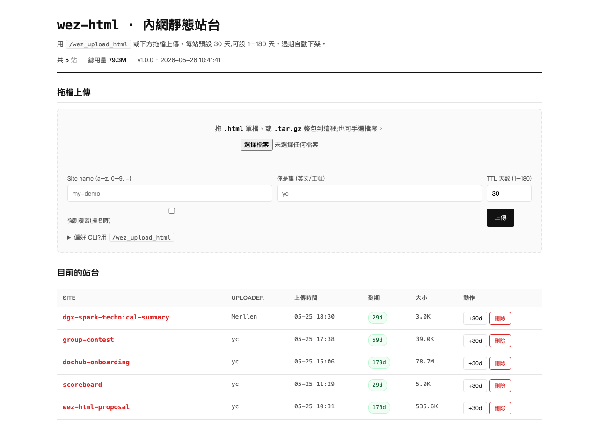

# wez-html

> 給小團隊內部用的 demo 站台 service。一行 command 把任何前端 / 單一 html 部署上去,**附過期、附 uploader 追溯、附刪除/延長介面、附 KV CRUD**。

```bash
$ ./bin/wez_upload_html ./frontend yc
✅ http://your-server:8090/frontend/  · 到期 2026-06-24
```

最常見的用法不是裸 CLI,而是透過 [claude-code plugin `/wez:upload-html`](https://github.com/yanchen184/wezoomtek-claude-code-plugin) 一句中文指令把 AI 寫的 HTML 直接推上線(見下方 [Claude Code plugin](#claude-code-plugin) 段)。



## 為什麼有這個東西

過去 demo 一個前端要做這些事:

1. `rsync` 推檔到內網某台機器
2. `ssh` 進去找個沒被佔的 port
3. `python -m http.server` 或起個 nginx
4. 貼 URL 給同事
5. 兩個月後忘了清,垃圾留在機器上

`wez-html` 把這些事壓成一句 CLI。再加三件原本沒有的:

- **TTL 強制** — 預設 30 天、上限 180 天,過期 service 自動 `rm -rf`,不再有「忘記清」的垃圾
- **Uploader 追溯** — 每個站台記 uploader identity,只有同一個 identity 能刪/延長
- **Web 介面** — 拖檔上傳 + 站台列表 + 一鍵刪除/延長,不會 CLI 也能用

## 適合 / 不適合

| 適合 | 不適合 |
|---|---|
| 內網 demo / poc / 個人賽作品分享 | Production hosting |
| 短期(< 半年)的 landing / 投影片 | 需要長期穩定 URL |
| 純靜態檔 + 輕量 CRUD(KV JSON) | 關聯式 query / 複雜 schema(直接接公司正式 DB) |
| 內網信任環境(VPN / 辦公室 LAN) | 公網開放(沒驗證、純 identity 追溯) |

## 三種使用方式

### 1. Claude Code plugin(推薦,內建 Mode A / B / C)

裝 plugin([wezoomtek-claude-code-plugin](https://github.com/yanchen184/wezoomtek-claude-code-plugin))後在 Claude Code 直接打:

```
/wez:upload-html ai-report.html yc          ← Mode A:推已有的 .html
/wez:upload-html yc "問卷 5 題畫圓餅圖"        ← Mode B:一句中文需求,Claude 寫網站 + 接 KV 再推
/wez:upload-html --list                     ← Mode C:管理(list / delete / extend)
```

Mode B 會自動生整套含 KV CRUD 的 HTML(KV API 範例、CSV 下載、無 CDN 規則⋯都在 plugin command markdown 內預載),使用者不用寫 prompt 細節。實際範例見 [威進競賽個人賽提案頁](http://10.1.1.7:8090/group-contest/)(整頁就是 Mode B + KV 即時回饋表單 dogfood demo)。

### 2. CLI(本機)

```bash
# 資料夾
./bin/wez_upload_html ./frontend yc

# 單一 html(自動包成 <site>/index.html)
./bin/wez_upload_html ./個人賽.html yc --name personal-contest

# 帶 TTL / 覆蓋撞名 / 自訂名稱
./bin/wez_upload_html ./demo bob --ttl 90 --name landing-2026
./bin/wez_upload_html ./demo alice --force   # 重推會「保留 KV `.data/`」,只換 HTML(v1.1.1+)

# 管理
./bin/wez_upload_html --list
./bin/wez_upload_html --delete frontend yc
./bin/wez_upload_html --extend frontend yc --ttl 60
```

`--server` flag 蓋掉預設 endpoint(預設 `http://localhost:8090`)。要全域可用,把 `./bin/wez_upload_html` 加 PATH 或 `sudo cp ./bin/wez_upload_html /usr/local/bin/`。

### 3. Web UI

打開 `http://your-server:8090/`,拖一個 `.html` 或 `.tar.gz` 進拖檔區,填 identity + TTL,送出。

## Build & 本機跑

```bash
make build       # build CLI + server
make run-local   # 本機 server: http://127.0.0.1:8090
```

另開 terminal:

```bash
mkdir -p /tmp/demo && echo '<h1>hi</h1>' > /tmp/demo/index.html
./bin/wez_upload_html /tmp/demo me --server http://127.0.0.1:8090
```

## 部署到 server

```bash
# 1. 編輯 scripts/wez-html.service,把 User / WorkingDirectory / --public-url 改成你的環境
# 2. 編輯 Makefile 的 WEZ_HOST / WEZ_USER,或用環境變數覆蓋
make deploy WEZ_HOST=myserver WEZ_USER=ubuntu GOARCH=arm64
```

要求:
- 該 host 有 SSH(`~/.ssh/config` 的 alias 或 `user@ip` 都行)
- 該 user 在 host 上有 `sudo` 權限(裝 binary + systemd unit)
- 目標機器架構對應 `GOARCH`(預設 `arm64`,x86 機改 `amd64`)

## KV CRUD(v1.1+)

每個站台都附一份輕量 JSON key-value store,給你的前端拿來存「demo 等級」的資料(scoreboard / 留言版 / poll 投票 / 設定持久化⋯)。

### Endpoints

```
GET    /<site>/api/kv           # list 所有 key + size
GET    /<site>/api/kv/<key>     # 讀一個 key (回原始 JSON)
PUT    /<site>/api/kv/<key>     # 寫(body 必須是合法 JSON)
DELETE /<site>/api/kv/<key>     # 刪
```

key 規則 `^[a-zA-Z0-9_-]{1,64}$`,value 必須是合法 JSON。

### 從前端用

```js
const KV = '/' + location.pathname.split('/')[1] + '/api/kv';

// 寫
await fetch(KV + '/score-1', {
  method: 'PUT',
  headers: { 'Content-Type': 'application/json' },
  body: JSON.stringify({ player: 'Alice', score: 42 }),
});

// 讀
const data = await (await fetch(KV + '/score-1')).json();

// 列出
const { keys } = await (await fetch(KV)).json();

// 刪
await fetch(KV + '/score-1', { method: 'DELETE' });
```

### 限制

- value ≤ 256KB
- 一站最多 1000 keys / 10MB 總量
- **沒 transaction、沒 query、沒 auth** — 同站台的人都讀寫得到。要鎖等 v2
- 資料活在 `<siteDir>/.data/<key>.json`,site 過期 reaper 整包刪掉,KV 跟著走

### 範例

`examples/scoreboard/` 是一頁完整的 CRUD demo(記分板,UI + KV 全包)。

```bash
./bin/wez_upload_html ./examples/scoreboard yc --name scoreboard
# 開 http://your-server:8090/scoreboard/ 直接玩
```


## 架構

- **Go single binary**(`wez-html-server` + `wez_upload_html` CLI),systemd 跑著
- 純檔案儲存 `/var/lib/wez-html/<site>/`,每站附一個 `.meta.json` 記 uploader / expires_at
- 過期清理在 server 程序內,內建 6h ticker 掃過期 site → `os.RemoveAll`
- SPA fallback:非 asset 路徑回 `index.html`,react-router 之類前端不會 404
- 上傳走 multipart;CLI 在本機打 tar.gz,Web UI 走 `/api/upload-single` 給 server 端建 wrapper

```
.
├── cmd/
│   ├── cli/         # wez_upload_html
│   └── server/      # wez-html-server
├── internal/
│   ├── archive/     # tar.gz pack/unpack with size/path limits
│   ├── handler/     # HTTP routes (含 KV CRUD)
│   ├── kv/          # 站台級 JSON key-value store
│   ├── meta/        # .meta.json read/write
│   ├── reaper/      # TTL sweeper
│   └── web/         # 內嵌 index.html template (embed.FS)
└── scripts/
    └── wez-html.service
```

## 限制

- **單檔 ≤ 50MB,單站 ≤ 500MB,共 ≤ 10000 檔**(在 `internal/archive/archive.go` 改)
- **TTL 1–180 天**(在 `internal/handler/handler.go` 的 `MinTTL` / `MaxTTL` 改)
- **identity 純追溯,不驗證**(內網信任模型)— 別人知道你的 identity 就能刪你的站,所以 identity 別用太通用的值
- **不支援 HTTPS**(對外端用 nginx / Caddy 反向代理)

## Claude Code plugin

真正在用的入口是 [wezoomtek-claude-code-plugin](https://github.com/yanchen184/wezoomtek-claude-code-plugin) 的 `/wez:upload-html`,把這個 server 包成三模式:

- **Mode A** — 第一個 arg 是 `.html` → multipart upload(等同裸 CLI)
- **Mode B** — 全是中文文字 → Claude 寫整個含 KV 整合的 HTML 再推
- **Mode C** — `--list` / `--delete` / `--extend`(等同裸 CLI 的管理指令)

plugin 內建生成 SOP(KV API 範例、字型 / 顏色變數、`escape()` helper、CSV-with-BOM、無 CDN 規則),所以 Mode B 不依賴使用者的 prompt 技巧。實際提案頁 [http://10.1.1.7:8090/group-contest/](http://10.1.1.7:8090/group-contest/) 就是 Mode B + KV 表單 dogfood。

## Changelog

- **v1.1.1**(2026-05-26)— `--force` 重新上傳時保留 KV `.data/` 目錄,KV 不再隨 redeploy 被砍
- **v1.1.0**(2026-05-25)— per-site KV CRUD 上線,scoreboard demo,deploy hardening
- **v1.0.0** — initial release

## v2 規劃

- HTTPS / Basic Auth(目前對外端建議 nginx / Caddy 反代,內建 option 待補)
- tar.gz multi-file 上傳(目前 Mode B 限單檔 HTML,要推整個 build dist 還做不到)
- Web UI batch upload(一次只能推一檔)
- ~~SQLite-as-a-service(Datasette 反向代理)~~ — KV 已涵蓋 demo 等級需求,暫不做

## License

MIT — 隨便拿去用,別告我就好。
