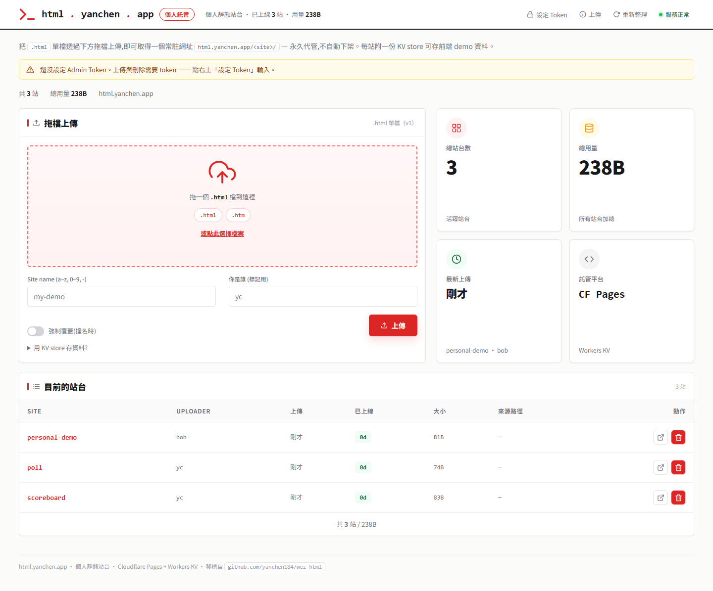

# html.yanchen.app — 個人迷你靜態託管站

> wez-html 的 Cloudflare 移植版：一個網域掛多個 HTML 站台,每站附一份 KV store,只有我能上傳/刪除。
> 純前端皮沿用 [wez-html](https://github.com/yanchen184/wez-html),後端由 Go 重寫成 **Cloudflare Pages Functions + Workers KV**。



---

## 這是什麼

把一個 `.html` 單檔拖上去,就拿到一個常駐網址:

```
html.yanchen.app/<site>/
```

- **多站台**:一個網域底下掛任意多個獨立站台,各自有網址。
- **每站一份 KV store**:站台前端可呼叫 `/<site>/api/kv/<key>` 存取自己的資料(計分板、投票、留言…),互不干擾。
- **永久代管**:不自動下架,清單顯示「已上線」天數。
- **只有我能改**:上傳 / 刪除需要 Admin Token,公開瀏覽不需要。

跟原版 wez-html 的差別:原版是公司內網、無真正認證(identity 只做溯源);這版面向公開,所以加了 `ADMIN_TOKEN` 保護寫入端。

---

## 架構

```
瀏覽器
  │
  ├─ GET  /                      → public/index.html(dashboard 皮)
  ├─ GET  /api/sites             → functions/api/sites.js        (公開,列站台)
  ├─ POST /api/upload-single     → functions/api/upload-single.js(需 token,上傳)
  ├─ DEL  /api/site/<name>       → functions/api/site/[name].js  (需 token,刪站)
  ├─ */PUT/DEL /<site>/api/kv/<key> → functions/[site]/api/kv/[key].js (同站信任,站台資料)
  └─ GET  /<site>/...            → functions/[[catchall]].js     (serve 站台檔案 + SPA fallback)
```

全部資料落在單一 Workers KV namespace(binding `SITES`),用 key 前綴分層:

| 前綴 | 內容 | 範例 key |
|---|---|---|
| `meta:<site>` | 站台 metadata(uploader、時間、大小、來源) | `meta:scoreboard` |
| `file:<site>/<path>` | 站台檔案內容 | `file:scoreboard/index.html` |
| `data:<site>/<key>` | 站台級 KV store(前端自存) | `data:scoreboard/rank` |

設計刻意走最簡 flat KV(YAGNI),個人用量下夠用且好維護。

---

## 本機開發

```bash
cd cloudflare
npm install

# 本機 token(已 gitignore,別 commit)
echo 'ADMIN_TOKEN=dev-local-token-123' > .dev.vars

npx wrangler pages dev --port 8788 --kv SITES
# → http://127.0.0.1:8788/
```

上傳(本機)範例:

```bash
curl -X POST http://127.0.0.1:8788/api/upload-single \
  -H "X-Admin-Token: dev-local-token-123" \
  -F "file=@hello.html" \
  -F "site=hello" \
  -F "identity=yc"
# → {"status":"ok","site":"hello","url":"http://127.0.0.1:8788/hello/",...}
```

站台級 KV(同站信任,免 token):

```bash
curl -X PUT  http://127.0.0.1:8788/hello/api/kv/count -d '{"n":1}'
curl http://127.0.0.1:8788/hello/api/kv/count   # → {"n":1}
```

---

## 部署(Cloudflare Pages + GitHub CI/CD)

1. **建 KV namespace**,把回傳 id 填進 `wrangler.toml`:
   ```bash
   npx wrangler kv namespace create SITES
   npx wrangler kv namespace create SITES --preview
   ```
2. **接 GitHub**:Cloudflare Dashboard → Pages → Create → Connect to Git,選本 repo,
   - Production branch:`cloudflare-pages`
   - Root directory:`cloudflare`
   - Build command:留空(無 build step)
   - Build output:`public`
3. **設 Admin Token**(別寫進 repo):
   ```bash
   npx wrangler pages secret put ADMIN_TOKEN
   ```
   或在 Pages → Settings → Environment variables 設。
4. **綁自訂網域**:Pages → Custom domains → 加 `html.yanchen.app`(yanchen.app 已在 Cloudflare DNS)。

之後 push 到 `cloudflare-pages` 分支 → Cloudflare 自動部署。

---

## 安全

- `ADMIN_TOKEN` **絕不進 git**:本機走 `.dev.vars`(gitignore),線上走 Cloudflare secret/env。
- 寫入端(上傳、刪站)強制驗 token;讀取端(瀏覽、列站、站台 KV 讀)公開。
- 站台級 KV 走「同站信任」:同網域下的頁面可讀寫自己站台的資料,跨站隔離靠 key 前綴。

---

移植自 [github.com/yanchen184/wez-html](https://github.com/yanchen184/wez-html)。
